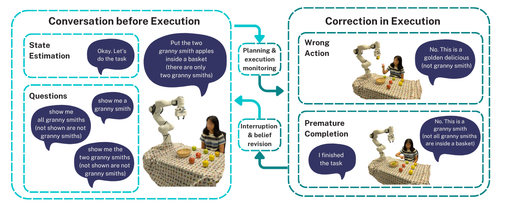

# SECURE: Semantics-aware Embodied Conversation under Unawareness for Lifelong Robot Learning


[Paper](https://arxiv.org/abs/2409.17755) | [Website](https://assistive-autonomy.github.io/secure/)



## Instalation

Install the dependencies using [poetry](https://python-poetry.org/):

```bash
peotry install
```

`mujoco_robot_environments` is a installed manually for now, namely:
```bash
poetry shell
pip install mujoco_robot_environments
```


## Simulation Experiments

Simulation experiments utilize [MuJoCo Robot Environments](https://github.com/peterdavidfagan/mujoco_robot_environments) for pick-and-place task. For the natural language generation (e.g. task synthesis and parsing referential expressions to logical forms) [CodeLlama 7b](https://huggingface.co/meta-llama/CodeLlama-7b-Instruct-hf) is used using [text-generation-inference](https://huggingface.co/docs/text-generation-inference/index) service. To perform generation, make sure to include service path in a config (e.g. config/default.yaml generator.client ..) You can check reachability bu running the following CURL command:

```bash
curl <service-path:port>/generate \
    -X POST \
    -d '{"inputs":"What is Deep Learning?","parameters":{"max_new_tokens":20}}' \
    -H 'Content-Type: application/json'
```

To run experiments in simulation run the following command:

```bash
poetry run python main.py
```

see ``config.py`` and ``congig/default.yaml.`` for experiment configuration.

## Citation

```bibtex
@misc{secure2025,
    title={SECURE: Semantics-aware Embodied Conversation under Unawareness for Lifelong Robot Learning},
    author={Rimvydas Rubavicius and Peter David Fagan and Alex Lascarides and Subramanian Ramamoorthy},
    year={2025},
    eprint={2409.17755},
    archivePrefix={arXiv},
    primaryClass={cs.RO},
    url={https://arxiv.org/abs/2409.17755}
}
```